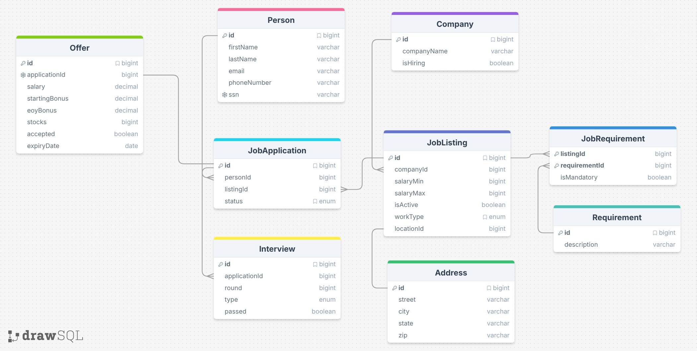

# Job Application Tracker

My project models data that a recruiter or job seeker might find useful. It tracks people applying for jobs, companies and their listings, requirements for each position, interviews conducted per application, and offers extended to candidates.



---

## Queries it handled well

### Who received a job offer and did they accept it?

All three strategies produced identical, correct SQL and clean friendly responses. This is a straightforward multi-table join with no aggregation or negation logic.

**GPT SQL (all strategies)**:
```sql
SELECT p.firstname, p.lastname, o.accepted
FROM Offer o
JOIN JobApplication ja ON o.applicationId = ja.id
JOIN Person p ON ja.personId = p.id;
```

**Friendly Response (single_domain)**: Here are the people who received a job offer along with whether they accepted it: Alice Nguyen: Accepted, David Kim: Did not accept, Rachel Morris: Accepted, Grace Hall: Accepted, Isla Warren: Accepted, Liam Price: Did not accept, Noah Barnes: Accepted. Note: Frank Lopez, Emma Patel, and Isla Warren received offers, but their acceptance status is unknown.

The single-domain and cross-domain responses were slightly better than zero-shot here — they explicitly called out the NULL acceptance statuses rather than just listing them without comment.

---

### Total compensation per offer, ranked highest to lowest

All three strategies correctly computed `salary + startingBonus + easyBonus`, filtered on `accepted = 1`, and ordered descending. The friendly responses were well-formatted and accurate.

**GPT SQL (zero_shot)**:
```sql
SELECT Offer.id, (Offer.salary + Offer.startingBonus + Offer.easyBonus) AS total_compensation,
       Person.firstname, Person.lastname
FROM Offer
JOIN JobApplication ON Offer.applicationId = JobApplication.id
JOIN Person ON JobApplication.personId = Person.id
WHERE Offer.accepted = 1
ORDER BY total_compensation DESC;
```

**Raw Result**: `[(7, 202000, 'Noah', 'Barnes'), (4, 185000, 'Grace', 'Hall'), (1, 145000, 'Alice', 'Nguyen'), (5, 143000, 'Isla', 'Warren'), (3, 102500, 'Rachel', 'Morris')]`

**Friendly Response**: Noah Barnes led with $202,000, followed by Grace Hall at $185,000, Alice Nguyen at $145,000, Isla Warren at $143,000, and Rachel Morris at $102,500.

---

### Companies with a higher rejection rate than acceptance rate

All three strategies used the same correct `CASE WHEN` conditional aggregation pattern and returned the same answer.

**GPT SQL**:
```sql
SELECT c.companyName
FROM Company c
JOIN JobApplication ja ON c.id = ja.companyId
GROUP BY c.id
HAVING SUM(CASE WHEN ja.status = 'rejected' THEN 1 ELSE 0 END)
     > SUM(CASE WHEN ja.status = 'offered' THEN 1 ELSE 0 END);
```

**Result**: BlueSky Solutions and PinnacleTech.

---

## Queries where strategies diverged or failed

### "Which applicants passed all of their interviews but never received an offer?"

This required combining two negative conditions — no failed interview + no offer — which is where strategies diverged significantly.

**Zero-shot SQL** (incorrect):
```sql
SELECT p.id, p.firstname, p.lastname
FROM Person p
JOIN JobApplication ja ON p.id = ja.personId
LEFT JOIN Offer o ON ja.id = o.applicationId
WHERE o.id IS NULL
AND ja.id NOT IN (
    SELECT i.applicationId FROM Interview i WHERE i.passed = 0
)
GROUP BY p.id;
```
Returned 11 people — too many. The NOT IN subquery correctly excludes applications with a failed round, but the GROUP BY p.id then collapses across all of a person's applications. Someone like Noah Barnes whose *one* application got an offer but has *another* still interviewing still slips through.

**Single-domain SQL** (correct):
```sql
SELECT p.id, p.firstname, p.lastname
FROM Person p
JOIN JobApplication a ON p.id = a.personId
WHERE a.id NOT IN (SELECT DISTINCT applicationId FROM Offer)
AND a.id IN (
    SELECT applicationId FROM Interview
    GROUP BY applicationId
    HAVING COUNT(*) = SUM(passed)
);
```
Returned 7 people — correct. The `HAVING COUNT(*) = SUM(passed)` trick elegantly checks that every interview was passed. Operating at the *application* level (not person level) avoids the cross-application contamination.

**Cross-domain SQL** (overcounts):
```sql
WHERE ja.id NOT IN (SELECT o.applicationId FROM Offer o)
AND NOT EXISTS (
    SELECT 1 FROM Interview i
    WHERE i.applicationId = ja.id AND i.passed IS NOT TRUE
);
```
Returned 11 — includes pending applications that have zero interviews, since `NOT EXISTS` vacuously passes when there are no interviews at all.

**Winner**: Single-domain. The example Q&A in the prompt appeared to anchor GPT toward application-level reasoning rather than person-level aggregation.

---

### "Which applicants have never failed a single interview round?"

This was the most consistently broken query across all strategies. The ambiguity is whether "never failed" means "has interviews and all passed" or "has never had a failed row" (which includes people who haven't interviewed yet).

**Zero-shot** and **single-domain** both used:
```sql
WHERE i.passed IS NULL OR i.passed = 1
```
This is logically wrong — it returns individual *rows* where the interview passed or has no result, not *people* who have no failed row. Combined with a `DISTINCT`, it returns nearly everyone because any single passing interview satisfies the WHERE for that person.

- Zero-shot returned 19 applicants (LEFT JOIN — includes people with no interviews).
- Single-domain returned 17 (INNER JOIN — excludes people with no interviews, but still wrong for anyone with mixed results).

**Cross-domain** used a NOT IN subquery to exclude applications with any failed round:
```sql
WHERE ja.id NOT IN (
    SELECT applicationId FROM Interview WHERE passed = 0
)
```
Logically closer to correct, but returns 21 rows with **duplicates** — the query was scoped to applications, not persons, so people with multiple applications appear multiple times. The friendly response de-duplicated them by name, but the raw data was noisy.

No strategy produced a fully correct, clean answer. A proper solution requires `NOT EXISTS` scoped to the person, or a `HAVING SUM(passed=0) = 0` guard.

---

### "Which job listings have received zero applications?" (NOT EXISTS edge case)

All three strategies produced correct SQL using `LEFT JOIN ... WHERE id IS NULL`. However, the friendly responses were weak — they just reported listing IDs ("Listings 5 and 12") without providing any context about what those positions were or which companies posted them.

**Zero-shot response**: "The job listings with IDs 5 and 12 have received zero applications."

This is accurate but nearly useless in practice. A better prompt or follow-up asking for company/role details would help.

---

### "Who applied to a job listing whose mandatory requirements they do not meet?"

This question is fundamentally unanswerable with the current schema — there is no `PersonSkill` table linking people to their qualifications. All three strategies failed, but in interestingly different ways:

- **Zero-shot**: Generated a query with commented-out `PersonSkill` joins and left them as dead code. The resulting SQL vacuously returned *all* 20 applicants as failing requirements — everyone "doesn't meet" requirements because no skills are recorded. Friendly response accepted this at face value.

- **Single-domain**: Returned an empty result. The SQL tried to join `JobRequirement` rows that couldn't be matched without a skills table, effectively filtering out everything.

- **Cross-domain** (worst): Confused `i.applicationId` with `jr.requirementId` in a JOIN — joining interview IDs against requirement IDs, which is semantically meaningless. Returned 8 person IDs with no names. The friendly response just repeated the IDs: "Candidates with IDs 6, 14, 15... applied to job listings without meeting requirements." — completely wrong data, no names.

This is a good illustration of a fundamental limitation: GPT will confidently generate SQL for a question the schema physically cannot answer. It never says "this data isn't tracked."

---

### "Which people applied to more than one company?" (strategy-dependent SQL quality)

An interesting case where single-domain produced *worse* SQL than the other two.

- **Zero-shot** and **cross-domain** both correctly used a subquery: `WHERE p.id IN (SELECT personId FROM JobApplication GROUP BY personId HAVING COUNT(DISTINCT companyId) > 1)` — returned 10 people with outcomes.

- **Single-domain** used: `GROUP BY p.id, ja.companyId HAVING COUNT(DISTINCT ja.companyId) > 1` — grouping *by* companyId and then checking `DISTINCT companyId > 1` within that group will always yield 1, so the HAVING always fails. **Returned empty set.** The friendly response confidently stated "No one has applied to more than one company" — factually wrong.

This is a subtle SQL logic error (the HAVING clause applies to the already-grouped result, not the full dataset) that the single-domain example may have inadvertently triggered.

---

## Conclusion

For straightforward lookups and joins with no negation, all three strategies perform reliably and produce accurate, friendly responses. The gaps appear consistently in three patterns:

1. **Negation and universal quantifiers** ("never failed", "passed ALL interviews") — GPT gravitates toward filtering rows rather than reasoning about the absence of rows. It rarely reaches for `NOT EXISTS` on its own; zero-shot and single-domain both used a WHERE condition that looks right but isn't.

2. **Missing data / unanswerable questions** — When the schema can't support the question (no PersonSkill table), GPT generates plausible-looking SQL anyway and confidently reports whatever the broken query returns. It never surfaces the missing table problem.

3. **Aggregation scope errors** — Single-domain occasionally over-learned from its example and applied GROUP BY at the wrong level, producing empty results with no error signal.

Cross-domain was the most structurally consistent across questions — the format hint from the inventory example seemed to nudge GPT toward cleaner subquery patterns — but it also showed the worst hallucination on the unanswerable question. Single-domain produced the best result on the hardest query (all-passed + no-offer) but the worst on the multi-company application question.
